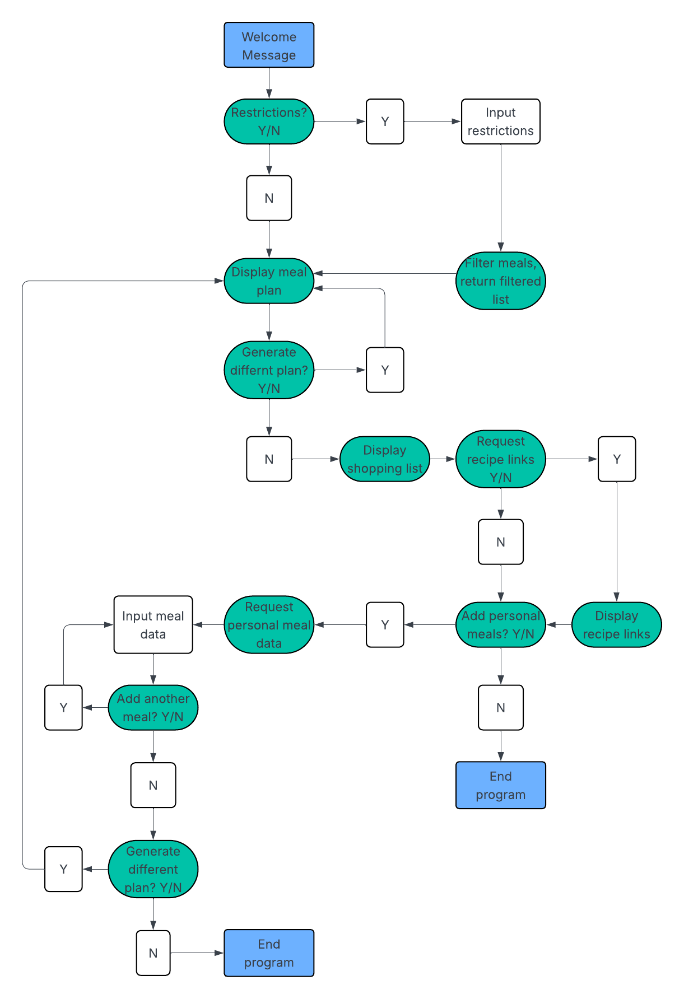

# Evening Meal Planner

Evening Meal Planner is a Python terminal application, which runs in the Code Institute mock terminal on Heroku.

The deployed program can be viewed [here](https://evening-meal-planner-9fed6f279af0.herokuapp.com/).

Evening Meal Planner is a program designed to return to the user a random meal plan of seven meals, one for each day of the week. Evening Meal Planner is interactive with the user, allowing them to manipulate the data structure with certain features.

The user is asked for dietary restrictions, which will prevent meals containing these items from being returned to the user in their meal plan.

The program generates a shopping list for the user, with all the ingredients they need to prepare the meals.

The user can view recipes for the meal plan.

Finally, the user can add their own personal meals to the data base. If they ask to generate a new meal plan, then their personal meals may be included.

# Table of Contents

* [User Stories](#user-stories)
* [Project Planning](#project-planning)
* [Features](#features)
* [Testing](#testing)
* [Deployment](#deployment)
* [Credits](#credits--acknowledgments)

## User Stories

User stories for the program include:

 - I am a person looking for a program to automatically generate a daily
   evening meal plan for the week.

-   I want the meal planner to adapt to my specific allergies or
   dislikes.
  
-   I want to have access to recipes for the meals to help me follow the
   meal plan.
   
-   I want to have a shopping list created for the plan.
   
-   I want the option to add my own bespoke meals to the list of meals.

## Project Planning

The user stories for the program and their acceptance criteria are outlined in the GitHub projects planning page which can be found [here](https://github.com/users/Rob-C-89/projects/9).

### Flowchart

A flowchart outlining the user journey has been created using [Lucidchart](https://www.lucidchart.com/pages/).

## Features

### Key Features

**Preliminary dietary restrictions**

Before returning their weekly meal plan, the user is asked if they have any allergies or dislikes. This compiles a list of dietary restrictions. The meal list is then filtered, to prevent dishes containing these foods from being returned to the user.

**Random meal plan generation**

The program then provides the user with a randomly generated list of seven meals, one for each day of the week. The user is asked if they are happy with their selection, or if they would like to see a different list.

**Shopping list creation**

After accepting their meal plan, the user is provided with a shopping list. This contains all the ingredients listed in the meals for their plan.

**Links to recipes**

The user is then asked if they would like to see recipe links for their meals.

**Add customised personal meals**

The user has the option to create their own meals and add them to the data structure. They can add as many meals as they like. They then have the option to generate another meal list, which may include the meals they have added, or exit the program.

### Future Features

The scope for extra features in this program is considerable. I ended the project having surpassed my standards for a minimum viable product, but some potential future features may include:

1. Separation of the contains/restrictions and the ingredients attributes. At conception of the project, the contains/restrictions attributes for the meal items was to be the only data used to filter the meals list, whereas the ingredient attributes was designed for the purpose of the shopping list.

   As the project progressed, it made sense to include the ingredients when filtering for disliked ingredients. 

   In the future, I would re-write the restrictions function to be a dropdown/numbered list of the 14 common allergens, and then have a seperate information request for dislikes. This would prevent someone who is allergic to fish, and mistyping e.g. 'fihs', being returned a list containing 'fish'.

2. The option to target and remove specific meals on the returned meal plan - if out of the seven meals, the user disliked the idea of one meal, they could have it removed and keep the meal plan mostly the same, with a new random meal for the removed item.

3. A main menu, with a differently organised flow to the program. As I progressed in my project, the flow of the user interactions grew slightly more complex than I had initially anticipated. 
   I consider it to still be a user-friendly and intuitive program, but with more time I would have the user land on a 'main menu', with options to begin with either seeing a meal plan, viewing the meal database, adding restrictions, or adding their personal meals. This would let the user tailor the experience more to their specific requirements.

4. Using an external database i.e. google sheets for the database. 

5.  Quantities for the shopping list i.e. 500g fish, 200g potatoes, etc.
    
6.  User input for the number of people following the meal plan, and this manipulating the shopping list quantities.
    
7.  A user login which saves restrictions and customised meals for future use.
    
8.  The option for the user to choose their own meal plan from the data centre, rather than see a random selection.

### Input Validation

1. When entering their restrictions, the user is prevented from responding with anything other than letters, whitespace and commas. The user can also not enter nothing and press enter. This is to prevent incorrect data input, and to encourage the user to write in the correct format to generate lists of items.

2. If the user's restrictions take the filtered meal list to below 7 items, they are requested to add their own meals, until the list has a minimum of 7 items.

3. On adding personal meals, the user is again prevented from entering anything other than letters, whitespace and commas, or inputting empty data, for the name, contains and recipe attributes. The same validation is not used for the recipe link, as this may contain numbers and symbols.

    
## Testing

### Manual Testing

I conducted a series of manual tests as a user using the program. These tests have been included below:

| Test Label                                                                             | Test Action                                                                                   | Expected Outcome                                                                  | Test Outcome                                                                                                                                                                             |
| -------------------------------------------------------------------------------------- | --------------------------------------------------------------------------------------------- | --------------------------------------------------------------------------------- | ---------------------------------------------------------------------------------------------------------------------------------------------------------------------------------------- |
| Run program / test deployment                                                          | Navigate to Heroku link                                                                       | Program is loaded and runs in browser                                             | PASS                                                                                                                                                                                     |
| Test restrictions function                                                             | 1\. Respond to function with no restrictions.  2\. Respond with a list of restrictions. | 1\. Program moves to next function.  2\. Program displays the filtered list | PASS                                                                                                                                                                                     |
| Test data validation on restrictions function                                          | Enter invalid data - symbols and numbers                                                      | Error message displayed, new user input requested                                 | PASS                                                                                                                                                                                     |
| Test add personal meal function                                                        | Enter all values in correct format                                                            | Data is accepted, new meal item is displayed to the user                          | FAIL - ‘new_recipe’ was not assigned a value.  On inspection, I had mistakenly included it in the while True loop for the contains attribute. I corrected the code for re-testing. |
| Re-test add personal meal function                                                     | Enter all values in correct format                                                            | Data is accepted, new meal item is displayed to the user                          | PASS                                                                                                                                                                                     |
| Test data validation on add personal meal function                                     | Enter invalid data - symbols and numbers, also blank input                                    | Error message displayed, new user input requested                                 | PASS                                                                                                                                                                                     |
| Personal meals are added to the meals list, possibility of being returned in meal plan | Request a different meal plan until the personal meal(s) is/are present                       | The personal meals added are included in the random list                          | PASS                                                                                                                                                                                     |
| Test general flow and program structure                                                | Run the program as a user several times, adding correct and incorrect data                    | The program runs with the expected flow as intended                               | PASS                                                                                                                                                                                     |

### Bugs and Fixes

I encountered a bug when, if the user added too many restrictions, a value error message was thrown and the program was halted:

To fix this, I wrote code to prompt the user to add more items until the meal list contains at least 7 items.

Another bug I encountered was from an error in my code, where after creating a while loop to validate data for the personal meal function, I accidentally included the recipe input in the wrong place. The error looked as follows:

As documented in the manul testing section, I moved the code out of the while loop to fix the bug.

Other than this I am unaware of any other bugs.

### PEP8 Validation

The code has been passed through [CI Python Linter](https://pep8ci.herokuapp.com/) with no errors found.

## Deployment

The project has been deployed using Code Institutes's Mock Terminal for Heroku. The URL for the website is:
https://evening-meal-planner-9fed6f279af0.herokuapp.com/

The deployment process is as follows:

- Fork or clone this repository (see section below for instructions)
- Create a new Heroku app
- Add config variable: key is 'PORT', value is 8000
- Set the buildpacks to 'Python' and 'Node.js', in that order (Python on top, Node.js underneath)
- Link the Heroku app to the repository
- Click on 'Deploy'

### Using the Repository

### Cloning

Cloning a repository pulls down a full copy of all the repository data that GitHub.com has at that point in time, including all versions of every file and folder for the project. You can push your changes to the remote repository on GitHub.com, or pull other people's changes from GitHub.com. 

You can clone the repository from using the following steps:

1. On GitHub, navigate to the main page of the repository
2. Above the list of files, click  <> Code.
3. Select whether you prefer HTTPS, SSH or CLI, then copy the URL with the clipboard icon
4. Open Git Bash or Terminal
5. Change the current working directory to the location where you want the cloned directory.
6. Type git clone, and then paste the URL. It will look like this:
    * git clone https://github.com/Rob-C-89/evening_meal_planner
7. Press Enter to create your local clone.

### Forking 

As an alternative to cloning the repo, you may fork it to your account. This will keep your version free from source updates, allowing you to work on the repository without code or content being altered.

You can fork the repository using the following stepsL

1. Log into your account then navigate to the repository:
    * https://github.com/Rob-C-89/evening_meal_planner
2. In the top-right corner of the window, you'll see a "Fork" button. 
3. Click the Fork button to begin the forking process.

## Credits & Acknowledgments

The following websites/resources were used extensively in the research, planning and development of the project:

W3 Schools - Python

https://www.w3schools.com/python/default.asp

Python Tutor

https://pythontutor.com/visualize.html#mode=edit

Code Institute’s Full Stack Software Developer Program

https://codeinstitute.net/

Code Institute provided the Python Essentials Template for this project

https://github.com/Code-Institute-Org/python-essentials-template

Articles and websites which I found useful while researching and developing my website are as follows:

Using ‘if in’ statements with dictionaries

https://discuss.python.org/t/how-do-i-select-something-from-a-dictionary-within-a-dictionary-using-an-if-statement/45423/6

For loop to iterate over dictionary elements

https://openstax.org/books/introduction-python-programming/pages/10-4-conditionals-and-looping-in-dictionaries

Online project for simple Allergy checking program

https://deepnote.com/app/sam-ola-ll/SamOlaModuleTwoProject-019ad06b-f24c-495a-86c6-83949de65cb8

GitHub foodAware program for detecting allergens in packaged food items

https://github.com/SaVa1/foodAware/blob/main/app.py

Medium Article “How to collect, process and validate data”
https://medium.com/informatics/user-input-in-python-how-to-collect-process-validate-data-271e482d183f

all() function

https://www.w3schools.com/python/ref_func_all.asp 

No large blocks of code were copied and pasted into this project.

A special thank you to my mentors Brian Macharia and Jubril Akolade for their guidance with this project.

